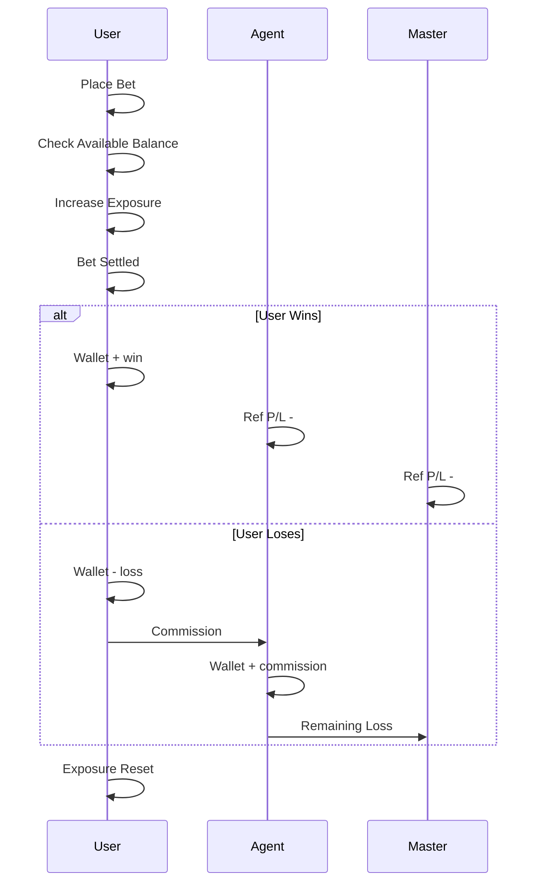

# BETTING PLATFORM – CORE SPEC (REFERENCE DOC)

## 1. Roles & Direction

```
Upline  -> gives credit, takes risk
Downline -> places bets, consumes credit
```

* Money always flows **up on loss**
* Liability always flows **up on win**

---

## 2. Wallet Model (ONLY SOURCE OF TRUTH)

Each account has:

```
wallet_balance
credit_reference
exposure
exposure_limit
commission_percent
rolling_commission (on/off)
```

---

## 3. Core Formulas (MEMORIZE THIS)

```
Total Limit = wallet_balance + credit_reference

Available Balance = Total Limit - |exposure|

Exposure <= exposure_limit  (always)
```

---

## 4. Meaning of Each Term (STRICT)

### Balance

```
Real money of this account
```

Changes on:

* Deposit
* Withdraw
* Bet settlement

---

### Credit Reference

```
Max loss allowed by upline
```

* Not real money
* Risk control only

---

### Exposure

```
Sum of max possible loss of all OPEN bets
```

* Always negative
* Released after settlement

---

### Exposure Limit

```
Hard cap on exposure
```

Used for:

* Block risky users
* Manual risk control

---

### Available Balance

```
Money user can still risk
```

Used in bet validation.

---

### Reference P/L (shown to parent)

```
Ref P/L = -(downline wallet balance)
```

Downline balance is **parent liability**.

---

## 5. Banking Rules (Deposit / Withdraw)

### Deposit (D)

```
Parent wallet -= amount
Child wallet  += amount
```

Rules:

* Parent must have balance
* Ledger entry required

---

### Withdraw (W)

```
Child wallet  -= amount
Parent wallet += amount
```

Rules:

* Available Balance >= withdraw amount
* Exposure not ignored

---

### Full Button

```
Withdraw full available balance
```

---

## 6. Bet Placement Rule (MOST IMPORTANT)

When bet placed:

```
max_loss = calculate from odds
```

Check:

```
if Available Balance >= max_loss
   allow bet
   exposure += max_loss
else
   reject bet
```

---

## 7. Settlement Rule

### If user wins

```
wallet_balance += win_amount
exposure = 0
```

Upline chain:

```
Ref P/L -= win_amount
```

---

### If user loses

```
wallet_balance -= loss_amount
exposure = 0
```

Upline chain:

```
Ref P/L += loss_amount
```

---

## 8. Commission Model (IMPORTANT)

### Commission %

* Set while creating user
* Applies ONLY on losses (industry standard)

### Loss Example

```
User loses = 10,000
Commission % = 2%
```

```
commission = 200
net loss = 9,800
```

Distribution:

```
User loses 10,000
Agent earns 200
Remaining 9,800 flows up
```

---

### Rolling Commission (Checkbox)

If ON:

```
Commission calculated per market / per bet
```

If OFF:

```
Commission calculated on net session loss
```

---

## 9. Add User Form – Meaning

| Field              | Meaning                |
| ------------------ | ---------------------- |
| Opening Balance    | Initial wallet balance |
| Credit Reference   | Max loss allowed       |
| Exposure Limit     | Risk cap               |
| Commission %       | Loss commission        |
| Rolling Commission | Per bet vs net         |
| Master Password    | Parent authorization   |

---

## 10. Ledger Rule (DO NOT BREAK)

Every action creates ledger row:

```
id
user_id
type (deposit | withdraw | bet | settle | commission)
amount
balance_after
timestamp
```

Never update balance without ledger.

---

## 11. SINGLE MERMAID – FULL FLOW



---

## 12. Mental Rule (FINAL)

* **Exposure blocks money**
* **Credit allows loss**
* **Balance is real**
* **Ref P/L is liability**
* **Commission only on loss**
* **Ledger never lies**

---